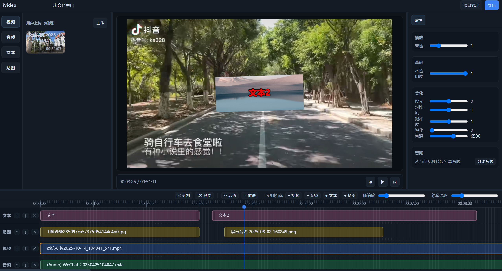
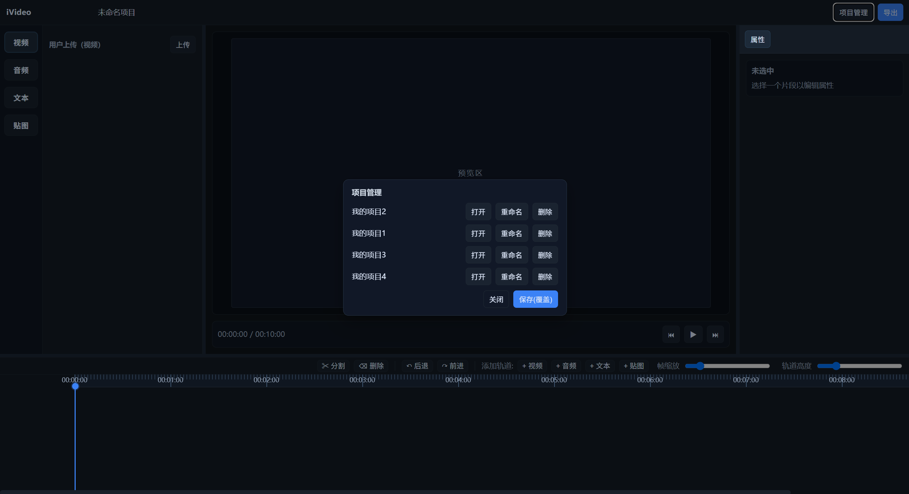
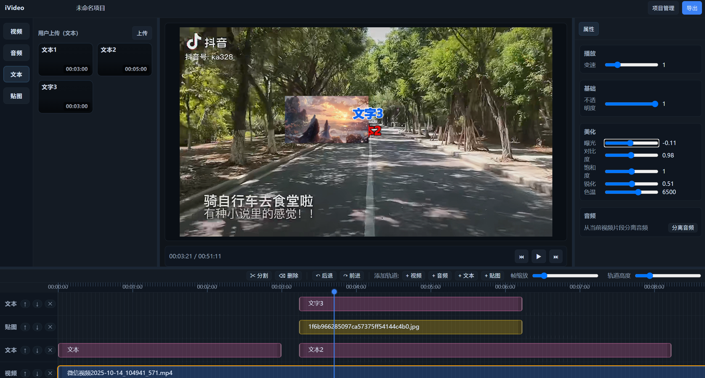
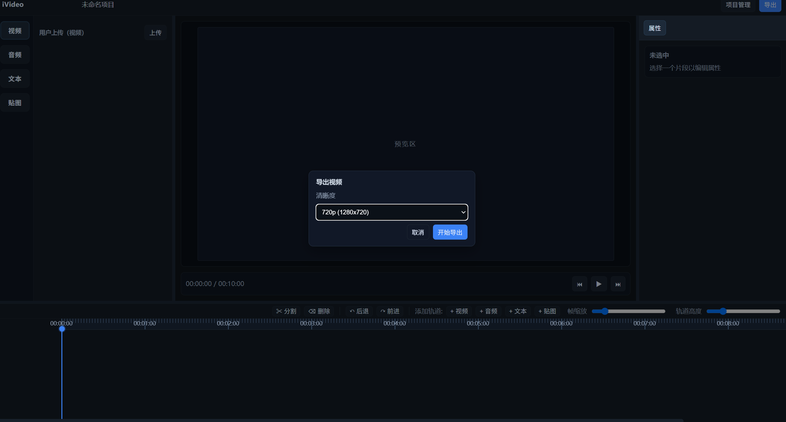

## iVideo - Web 端轻量剪辑器

基于 Vite + Vue 3 + TypeScript + Pinia 的本地视频剪辑与导出工具。支持多轨时间线、文本/贴图覆盖层、所见即所得编辑、工程保存/加载与 WebM 导出（画面 + 音轨混流）。

### 图片展示（单列，引用根目录 picture/）

> 将图片放到根目录的 `picture/` 文件夹后，按需修改以下文件名。







---

### 项目简介

- 目标：在浏览器端完成基础的视频剪辑与导出，无需服务端。
- 适用：课程作业/教学演示/轻量创作场景。
- 推荐环境：桌面端 Chrome/Edge 最新版。

## 功能特性

- 资产面板
  - 上传 视频/音频/贴图（图片），自动生成缩略图
  - 拖拽或双击将素材加入时间线
- 时间线编辑
  - 多轨（视频/音频/文本/贴图）
  - 片段拖动、裁剪、分割（支持撤销/重做）
  - 播放头与标尺、时间线缩放、轨道高度调节
- 预览与覆盖层
  - Canvas 渲染视频底层
  - 文本/贴图覆盖层：可视化拖拽/缩放/旋转，所见即所得；编辑态避免与画布叠影
  - 画面美化：曝光、对比度、饱和度、锐化、色温
- 属性面板（配置驱动）
  - 按片段类型（video/audio/text/sticker）展示不同字段
  - 表单改动实时写回工程数据并触发预览
- 工程存储与导出
  - 本地保存/加载工程（localStorage）
  - WebM 导出：Canvas.captureStream + WebAudio 混流，带导出进度
- 布局与分割条
  - 左/右面板宽度、时间线高度可拖拽调整，双击复位

## 技术栈

- 构建：Vite 5、TypeScript 5
- 框架：Vue 3、Pinia
- 媒体：Canvas 2D、MediaRecorder、WebAudio
- 样式：CSS 变量 + 自定义样式

## 文件结构（含注释）

```text
iVideo/
├─ index.html                 # 入口 HTML（挂载 #app，加载 /src/main.ts）
├─ package.json               # 项目依赖与脚本（dev/build/preview）
├─ package-lock.json
├─ tsconfig.json              # TS 编译配置
├─ vite.config.ts             # Vite 配置（Vue 插件、devServer）
├─ node_modules/              # 第三方依赖（框架代码）
└─ src/
   ├─ main.ts                 # 应用入口（创建 Vue 应用、安装 Pinia、挂载 App）
   ├─ main.js                 # 早期原生 JS 原型（未被 index.html 使用）→ 可移除/归档
   ├─ App.vue                 # 根组件：左(资产) / 中(预览) / 右(属性) / 底(时间线)
   ├─ styles.css              # 全局样式与 CSS 变量（布局/时间线/覆盖层）
   ├─ types.ts                # 共享类型定义（Clip/Track/ProjectSnapshot 等）
   │
   ├─ config/
   │  └─ panels.ts            # 属性面板 schema（按类型配置字段/分组）
   │
   ├─ core/                   # 核心业务模块（自研）
   │  ├─ timeline.ts          # 时间线编辑器（拖动/裁剪/分割/撤销重做/缩放/入轨）
   │  ├─ preview.ts           # 预览渲染（视频 + 文本/贴图覆盖层 + 美化 + 播放）
   │  ├─ assets.ts            # 资产面板（上传/缩略图/拖拽/双击入轨，工程加载补卡）
   │  ├─ serialization.ts     # 工程保存/加载、导出 WebM（Canvas+WebAudio，含进度）
   │  └─ resizer.ts           # 分割条逻辑（左/右/时间线尺寸，双击复位）
   │
   ├─ components/             # 视图组件（自研）
   │  ├─ Timeline/
   │  │  └─ Timeline.vue      # 时间线容器与控件（mounted 调用 core/timeline.init）
   │  └─ Panels/
   │     └─ PropertiesPanel.vue # 属性面板（读取 schema、更新 store、触发重建）
   │
   ├─ store/                  # 全局状态（Pinia）
   │  ├─ project.ts           # 工程态：name/fps/duration/tracks + 历史栈（undo/redo）
   │  └─ ui.ts                # UI 态：playhead/pxPerFrame/trackHeight/selectedClipId
   │
   └─ _timeline_dump.txt      # 调试/样例数据（可选）
```

说明：
- 框架/配置：`node_modules/`、`index.html`、`package*.json`、`tsconfig.json`、`vite.config.ts`、`src/main.ts`
- 自研/业务：`src/core/**`、`src/components/**`、`src/store/**`、`src/config/**`、`src/App.vue`、`src/styles.css`、`src/types.ts`
- 遗留/原型：`src/main.js`（不被使用，建议移除或迁至 docs/examples）

## 架构与数据流

- 视图层：`App.vue` 组织三栏 + 时间线；`Timeline.vue` / `PropertiesPanel.vue` 承载交互
- 状态层：Pinia
  - `project`：工程数据（tracks/clips）与历史栈（pushHistory/undo/redo）
  - `ui`：播放头、缩放、轨道高度、当前选中片段
- 核心层（core）
  - `timeline`：DOM 驱动的时间线编辑与事件发射
  - `preview`：Canvas 渲染与覆盖层编辑（文本/贴图）
  - `assets`：上传、缩略图、拖拽/双击入轨
  - `serialization`：保存/加载与导出
  - `resizer`：布局尺寸控制（CSS 变量）
- 事件协议（关键自定义事件）
  - `ivideo-set-playhead` / `ivideo-playhead-change` / `ivideo-rebuild` / `ivideo-update-clip`
  - `ivideo-add-clip` / `ivideo-selection-change` / `ivideo-ensure-asset-card`
  - `ivideo-media-invalid`（资源重连）/ `ivideo-export-*`（导出进度/完成）

## 快速开始

### 环境要求
- Node.js >= 18（推荐 LTS）
- Chrome/Edge 最新版（导出功能需要 MediaRecorder/WebAudio 支持）

### 安装
```bash
git clone <your-repo-url> iVideo
cd iVideo
npm install
```

### 开发启动
```bash
npm run dev
# 默认 http://localhost:5173
```

### 构建与预览
```bash
npm run build
npm run preview
# 预览默认 http://localhost:4173
```

## 使用指南

1) 上传素材
- 左侧资产面板点击“上传”，选择视频/音频/图片；文本可在面板内创建

2) 添加到时间线
- 拖拽素材到目标轨道（或双击自动入合适轨）

3) 编辑片段
- 拖动：移动位置；句柄：裁剪；播放头处：分割；工具栏支持撤销/重做

4) 文本/贴图覆盖层
- 在预览区域双击文本进入编辑；拖拽控制点缩放、旋转；贴图同理

5) 属性面板
- 按片段类型显示不同字段（如视频的曝光/对比度/饱和度/锐化/色温；文本的颜色/加粗/描边；贴图的位置/缩放/旋转/透明度）

6) 保存/加载
- 顶部“项目管理”弹窗：保存到 localStorage / 选择加载

7) 导出视频
- 顶部“导出”：选择分辨率（720p/1080p/自定义），生成 WebM 并下载

## 部署与运行（多平台）

### Windows / macOS / Linux（本地）
```bash
npm install
npm run build
npm run preview
```

- 亦可将 `dist/` 托管于任意静态服务器（Nginx/Apache/Netlify/Vercel 等）
- Nginx 示例（简化）：
```nginx
server {
  listen 80;
  server_name your.domain.com;
  root /var/www/ivideo/dist;
  index index.html;
  location / { try_files $uri $uri/ /index.html; }
}
```

### Docker（可选）
```Dockerfile
FROM node:18-alpine AS build
WORKDIR /app
COPY package*.json ./
RUN npm ci
COPY . .
RUN npm run build

FROM nginx:alpine
COPY --from=build /app/dist /usr/share/nginx/html
EXPOSE 80
```
```bash
docker build -t ivideo .
docker run -p 8080:80 ivideo
# 打开 http://localhost:8080
```

## 配置说明

- 开发服务器 & 构建：`vite.config.ts`
- TypeScript 编译：`tsconfig.json`
- 属性面板字段：`src/config/panels.ts`（按类型/分组扩展）
- 样式与布局变量：`src/styles.css`（`--left-width`/`--right-width`/`--timeline-height` 等）
- 说明：`src/main.js` 为早期原型，不在 `index.html` 中加载（建议移除/归档）

## 已知问题与建议

- 导出音频收集依赖 DOM 中 `<video|audio>`，建议在 `preview` 中登记媒体元素以确保混流完整
- 高清屏建议按 `devicePixelRatio` 调整 canvas 分辨率
- `URL.createObjectURL` 建议在素材回收时 `revokeObjectURL`
- 事件总线与直接 DOM 交互较多，后续可向 Vue 组件化/Pinia/mitt 收敛

## 贡献指南

- 分支：`feature/*`、`bugfix/*`、`release/*`
- 提交：语义化信息（feat/fix/refactor/docs/chore）
- 代码规范：TypeScript 严格模式、明确命名（函数动词、变量名语义化）
- 代码审查：导出兼容、媒体错误处理、性能热点（像素级处理）

## 许可证

- 用于教学与演示，许可证请自定义（MIT/Apache-2.0/…）


